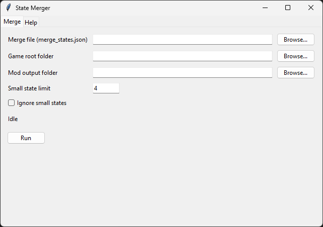
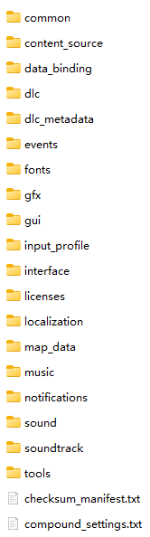
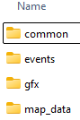

# Victoria 3 States Merging Automation Script & Tutorial

[简体中文](docs/README_zh-CN.md)

Check out my [State Merging Mod](https://github.com/ShabbyGayBar/StateMerging) generated by this script! Available on [Steam Workshop](https://steamcommunity.com/sharedfiles/filedetails/?id=3371693463)!

## Description

This repository contains a Python project that automates the process of merging states in Victoria 3.

It generates the following files that can be used in a Victoria 3 mod:
- `/common/...`
- `/event/...`
- `/map_data/state_regions/...`

## How to Make Your Own State Merging Mod

### Step 0: Prerequisites

- **Either:**
  - Download the latest GUI executable file from the [release page](https://github.com/ShabbyGayBar/StateMerger/releases). (Recommended but Windows only)
  - **Or:**
  - Install [Python 3.10 or later](https://www.python.org/downloads/).
  - Run
    `pip install "https://github.com/ShabbyGayBar/StateMerger/releases/download/v2.0.2/vic3_state_merger-2.0.2-py3-none-any.whl"`
    to install the package via pip.
- **Either**:
  - **Install Victoria 3 Vanilla game (e.g. via Steam),** If you want to make a mod from scratch
  - **Or:**
  - **Install a Victoria 3 mod (e.g. via Steam),** if you want to merge states in that mod.

### Step 1: Write the State Merging Rules

The `merge_state.json` file contains the rules for merging states. You can download this file from the [release page](https://github.com/ShabbyGayBar/StateMerger/releases) which contains a list of vanilla game states, and customize your own state merging rules.

The keys in the `merge_state.json` file are strings representing a state id. The values are lists of strings representing state id.

All states in the value list will be merged into the state in the key.

For example, the following rule merges `state_1`, `state_2`, and `state_3` into `state_0`:
```json
{
    "state_0": ["state_1", "state_2", "state_3"]
}
```

### Step 2: Run the Script

#### If You Downloaded the EXE file (Windows Only)

- Run `state-merger.exe` by double-clicking it.
- The GUI will pop up.

  

- Fill in:
  - *Merge file (merge_states.json)*: The one you edited in Step 1.
  - *Game root directory*: The root directory of your Victoria 3 game installation or base mod.
    **Beware!** The game root directory should be the `game` folder **under** the Victoria 3 installation directory or the mod directory. In other words, you should see the following content **inside this directory**:

    

  - *Mod output folder*: Where you want the generated mod files to be saved.
  - *Small state limit* (optional): The maximum number of provinces a state can have to be considered "small". Default is 4.
  - *Ignore small states* (optional): If set, states will not be granted buffs when merging *small states* defined above.
- Click the "Run" button to start the merging process.
- The execution of the script should take about 5 minutes.
- After the script finishes, you should see the following folders in your mod output folder:

  

- You still need to create a `.metadata` folder to make the game recognize your mod. You can also add other mod contents. Refer to [Victoria 3 Wiki](https://vic3.paradoxwikis.com/Modding) for further information.

#### If You Installed the Package (CLI)

Run the CLI with required positional arguments:

```
state-merger-cli <merge_file> <game_root> <mod_dir> [--data-dir <path>] [--small-state-limit <int>] [--ignore-small-states]
```

Example:

```
state-merger-cli merge_states.json "C:/Program Files (x86)/Steam/steamapps/common/Victoria 3/game" "C:/path/to/mod"
```

You can also type `state-merger-cli --help` to see all available options.

### Step 3: Edit Spline Network

Now comes the last **manual** part of the process. You need to edit the spline network to remove the invalid hubs of the merged states and reshape the road network between the new states.

- Open the Victoria 3 game in debug mode.
- Open the console by pressing `~`.
- Type `map_editor` and press `Enter`.
- Click on the `Spline Network` tab or press `9`.
- Choose the `Edit hub` tool.
- Select invalid hubs (those without names displayed on top) and press `Delete`.
- Choose the `Add spline` tool.
- Redraw the road connections between the remaining state hubs.

Further detailed information on how to edit the spline network can be found in [this steam tutorial](https://steamcommunity.com/sharedfiles/filedetails/?id=3165669021).

## Feedback

### Bug Reports

Please report any bugs you encounter in the Issues tab using the bug report template.

## Acknowledgments

- The Python script for paradox file parsing uses [Pyradox](https://github.com/ajul/pyradox).
- The Victoria 3 game and its data files are the property of Paradox Interactive.
- This project is an unofficial modding tool and is not affiliated with or endorsed by Paradox Interactive.

## License

This project is licensed under the MIT License - see the [LICENSE](LICENSE) file for details.
