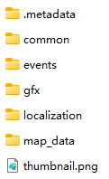

# Victoria 3 States Merging Automation Script & Tutorial

[简体中文](README_zh-CN.md)

Check out my [State Merging Mod](https://github.com/ShabbyGayBar/StateMerging) generated by this script! Available on [Steam Workshop](https://steamcommunity.com/sharedfiles/filedetails/?id=3371693463)!

## Description

This repository contains a Python script that automates the process of merging states in Victoria 3.

It generates the following files that can be used in a Victoria 3 mod:
- `/common/...`
- `/event/...`
- `/map_data/state_regions/...`

## How to Make Your Own State Merging Mod

### Step 0: Prerequisites

- Install [Python 3.8 or later](https://www.python.org/downloads/).
- Download and unzip the State Merger zip file in the [release page](https://github.com/ShabbyGayBar/StateMerger/releases).
- You could choose either one of the following methods, depending on whether you want to make a mod from scratch or use an existing mod as a base.
  - Install Victoria 3 Vanilla game (e.g. via Steam).
  - Install a Victoria 3 mod (e.g. via Steam) that you want to use as a base.

### Step 1: Write the State Merging Rules

The `merge_state.json` file contains the rules for merging states. You can edit this file to customize the state merging rules.

The keys in the `merge_state.json` file are strings representing a state id. The values are lists of strings representing state id.

All states in the value list will be merged into the state in the key.

For example, the following rule merges `state_1`, `state_2`, and `state_3` into `state_0`:
```json
{
    "state_0": ["state_1", "state_2", "state_3"]
}
```

### Step 2: Run the Script

- Navigate to the Victoria 3 `/game` directory under the root directory (or the mod root directory). You should see the following:
  -  `/game` directory under the root directory

    

  -  mod root directory

    

- Copy the path of the Victoria 3 game root directory (or the mod root directory).
- Navigate to the directory where you unzipped the State Merger zip file.
- Right click `./main.py` and open in notepad or other text editor.
- Replace the `game_root_dir` variable with the path you copied in the previous step. Make sure to use double backslashes `\\` or single forward slashes `/` as path separators, and add a trailing backslash `\\` at the end of the path.

  For example, if your game root directory is:
  `C:\Program Files (x86)\Steam\steamapps\common\Victoria 3\game`,

  you should set

  `game_root_dir = "C:\\Program Files (x86)\\Steam\\steamapps\\common\\Victoria 3\\game\\"`

  or

  `game_root_dir = "C:/Program Files (x86)/Steam/steamapps/common/Victoria 3/game/"`.

- Run the script by double clicking `./main.py` or running `python ./main.py` in a terminal.
- The execution of the script should take about 5 minutes.
- After the script finishes, you should see a new folder named `mod` in the same directory as the script. This folder contains the generated files shown in the description section.
- Copy the contents of the `mod` folder to your mod folder. You still need to create a `.metadata` folder to make the game recognize your mod. You can refer to [Victoria 3 Wiki](https://vic3.paradoxwikis.com/Modding) for further information.

### Step 3: Edit Spline Network

Now comes the last **manual** part of the process. You need to edit the spline network to remove the invalid hubs of the merged states and reshape the road network between the new states.

- Open the Victoria 3 game in debug mode.
- Open the console by pressing `~`.
- Type `map_editor` and press `Enter`.
- Click on the `Spline Network` tab or press `9`.
- Choose the `Edit hub` tool.
- Select invalid hubs (those without names displayed on top) and press `Delete`.
- Choose the `Add spline` tool.
- Redraw the road connections between the remaining state hubs.

Further detailed information on how to edit the spline network can be found in [this steam tutorial](https://steamcommunity.com/sharedfiles/filedetails/?id=3165669021).

## Feedback

### Bug Reports

Please report any bugs you encounter in the Issues tab using the bug report template.

## Acknowledgments

- The Python script for paradox file parsing is based on the [Victoria 3 Modding Toolkit](https://github.com/jakeOmega/Victoria3ModdingToolkit).
- The Victoria 3 game and its data files are the property of Paradox Interactive.
- This project is an unofficial modding tool and is not affiliated with or endorsed by Paradox Interactive.

## License

This project is licensed under the MIT License - see the [LICENSE](LICENSE) file for details.