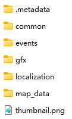

# 维多利亚3省份合并工具&教程

作者的[省份合并 mod](https://github.com/ShabbyGayBar/StateMerging) 已经发布在 [Steam 创意工坊](https://steamcommunity.com/sharedfiles/filedetails/?id=3371693463)！

## 简介

本项目包含若干 Python 脚本，用于自动化合并维多利亚3中的省份。

脚本可以自动生成以下维多利亚3的 mod 文件：
- `/common/...`
- `/event/...`
- `/map_data/state_regions/...`

## 省份合并教程

### 0. 准备工作

- 安装 [Python 3.8](https://www.python.org/downloads/) 或更高版本。
- 下载并解压发布页面中的 State Merger 压缩包。
- 根据需要选择以下两种方法之一，取决于您是从头开始制作 mod 还是使用现有 mod 作为基础。
  - 安装维多利亚3原版游戏（例如通过 Steam）。
  - 安装您想要用作基础的维多利亚3 mod（例如通过 Steam）。

### 1. 编写省份合并规则

省份合并规则保存在 `merge_state.json` 文件中。您可以编辑此文件以自定义省份合并规则。

`merge_state.json` 文件中的键是省份 ID 的字符串。值是表示省份 ID 的字符串列表。

值列表中的所有省份将合并到键中的省份中。

例如，以下规则将 `state_1`、`state_2` 和 `state_3` 合并到 `state_0` 中：
```json
{
    "state_0": ["state_1", "state_2", "state_3"]
}
```

### 2. 运行脚本

- 在文件管理器中打开维多利亚3游戏根目录（或 mod 根目录）。您应该看到以下内容：
  - 游戏根目录下的 `/game` 目录
    
  - mod 根目录
    
- 复制维多利亚3游戏根目录（或 mod 根目录）的路径。
- 右键单击 `./state_merger_script.py` 并在记事本或其他文本编辑器中打开。
- 用您在上一步中复制的路径替换 `game_root_dir` 变量。请确保使用双反斜杠 `\\` 或单斜杠 `/` 作为路径分隔符，并在路径末尾添加反斜杠 `\\`。
  例如，如果您的游戏根目录是：
  `C:\Program Files (x86)\Steam\steamapps\common\Victoria 3\game`，
  您应该设置
  `game_root_dir = "C:\\Program Files (x86)\\Steam\\steamapps\\common\\Victoria 3\\game\\"`
  或
  `game_root_dir = "C:/Program Files (x86)/Steam/steamapps/common/Victoria 3/game/"`。
- 双击 `./state_merger_script.py` 运行脚本，或在终端中运行 `python ./state_merger_script.py`。
- 脚本运行完成后，您应该在与脚本相同的目录中看到一个名为 `mod` 的新文件夹。此文件夹包含描述部分中显示的生成文件。
- 将 `mod` 文件夹的内容复制到您的 mod 文件夹中。您仍然需要创建一个 `.mod` 文件以使游戏识别您的 mod。更多信息请参考 [维多利亚3 Wiki](https://vic3.paradoxwikis.com/Modding)。
  
### 3. 编辑 Spline Network

接下来是整个过程的最后一个手动部分。您需要编辑 spline network 以删除被合并省份的无效城市模型并重绘省份之间的新道路网络。

- 以调试模式打开维多利亚3游戏。
- 按 `~` 键打开控制台。
- 输入 `map_editor` 并按 `Enter` 键。
- 单击 `Spline Network` 选项卡或按 `9` 键。
- 选择 `Edit hub` 工具。
- 选择无效的城市模型（在顶部没有显示名称的）并按 `Delete` 键。
- 选择 `Add spline` 工具。
- 重新绘制剩余省份之间的道路连接。
- 详细信息请参考 [此 Steam 教程](https://steamcommunity.com/sharedfiles/filedetails/?id=3165669021)。

## 反馈

### Bug 反馈

如果您遇到任何问题，都请在 Issues 中提出。

## 声明

- 本 Python 脚本基于 [Victoria 3 Modding Toolkit](https://github.com/jakeOmega/Victoria3ModdingToolkit) 编写。
- 维多利亚3游戏及其数据文件归 Paradox Interactive 所有。
- 本项目是非官方的 modding 工具，与 Paradox Interactive 无关。
